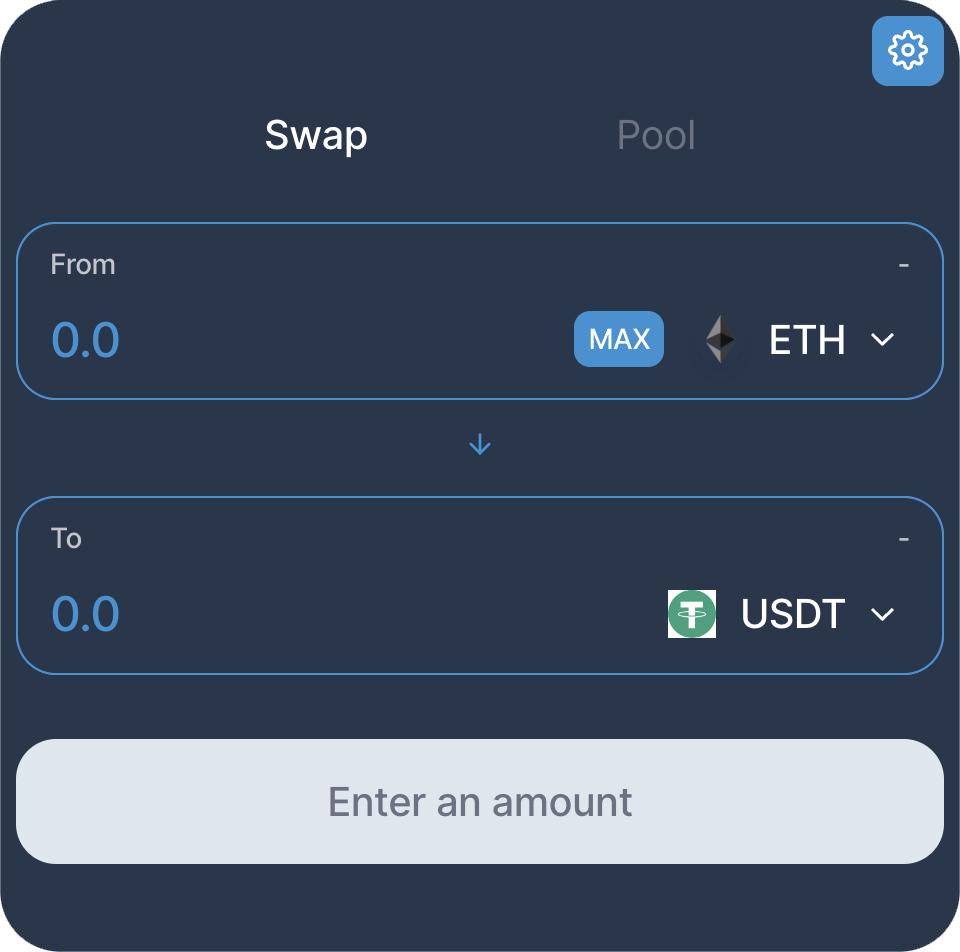

## AzurSwap Iframe
By utilizing the powerful and versatile capabilities of Iframe, you can provide your users with a more focused and astonishing experience. By adding a DEX page to your website and connecting it to the AzurSwap smart contract, users will be able to engage in cryptocurrency trading easily and swiftly. On this page, they can trade and exchange their digital assets, taking advantage of opportunities for greater profitability and efficiency. Additionally, with the liquidity pool feature, you can take necessary actions to ensure liquidity in this market and contribute to its trading dynamics. Therefore, by adding a DEX page to your website using Iframe, you can create a professional and secure experience for your users, enabling them to engage in trading and transactions with cryptocurrencies.

## Introduction

To use it, simply follow the two methods below:

### 1. Using a direct link as an iframe
To utilize this method, simply use the following link as an iframe code tag:
https://iframe.azurswap.org
For example:
```html
<iframe src="https://iframe.azurswap.org"></iframe>
```
This will embed the AzurSwap page directly into your website using an iframe.

You can customize the input parameters `inputCurrency` and `outputCurrency` to pre-select the desired inputs by default.

For example:

```bash
https://iframe.azurswap.org/#/swap?inputCurrency=ETH
```
or

```bash
https://iframe.azurswap.org/#/swap?outputCurrency=0xdAC17F958D2ee523a2206206994597C13D831ec7
```

Additionally, you can combine both parameters to set both the input and output currencies by default:

```bash
https://iframe.azurswap.org/#/swap?inputCurrency=ETH&outputCurrency=0xdAC17F958D2ee523a2206206994597C13D831ec7
```

In the examples provided, `inputCurrency` is set to `ETH` and `outputCurrency` is set to `0xdAC17F958D2ee523a2206206994597C13D831ec7`. You can use similar parameters with the desired currency addresses to customize the default inputs according to your preference.


To add custom styling, you can modify it as follows:

```html
<iframe
  src="https://iframe.azurswap.org/#/swap?inputCurrency=ETH&outputCurrency=0xdAC17F958D2ee523a2206206994597C13D831ec7"
  height="660px"
  width="100%"
  style="
    border: 0;
    margin: 0 auto;
    margin-bottom: .5rem;
    display: block;
    border-radius: 10px;
    max-width: 960px;
    min-width: 300px;
  "
/>
```

In this code snippet, you can customize the iframe's styling to suit your needs. Adjust the values of `height`, `width`, and the CSS properties inside the `style` attribute to achieve your desired appearance.

> If you want to have faster speed and run it on your own server, go with the second method.

### 2. Clone on your host / server
If you need to use your own CSS or make specific visual changes, you can place it in your project. When using this approach, the execution speed will depend on the performance of your hosting network or server.

To begin, you need to clone the iframe into your project. You can do this by using the following command to clone it into your project directory:

```bash
git clone https://github.com/AzurSwap/iframe.git
```

This command will clone the iframe repository into your project folder. 

After cloning the repository, you can utilize your specific inputs such as `inputCurrency` and `outputCurrency`. Additionally, you can modify the input value using the `exactAmount` parameter.

For example:

```
/swap?exactField=input&exactAmount=1000&inputCurrency=0x0F5D2fB29fb7d3CFeE444a200298f468908cC942
```

In this example, `exactField` is set to `input`, `exactAmount` is set to `1000`, and `inputCurrency` is set to `0x0F5D2fB29fb7d3CFeE444a200298f468908cC942`. You can customize these parameters based on your specific requirements.

> Please note that in this case, you need to use your own domain:
```
www.yourdomain.com/...
```
When using the iframe tag, it will be:
```html
<iframe src="https://www.yourdomain.com"></iframe>
```

or 
```html
<iframe src="https://www.yourdomain.com/swap?exactField=input&exactAmount=10&inputCurrency=0x0F5D2fB29fb7d3CFeE444a200298f468908cC942"></iframe>
```
<br>
By using this iframe, you can easily direct your customers to your website and encourage them to make purchases and create liquidity for you.<br>
Good luck
